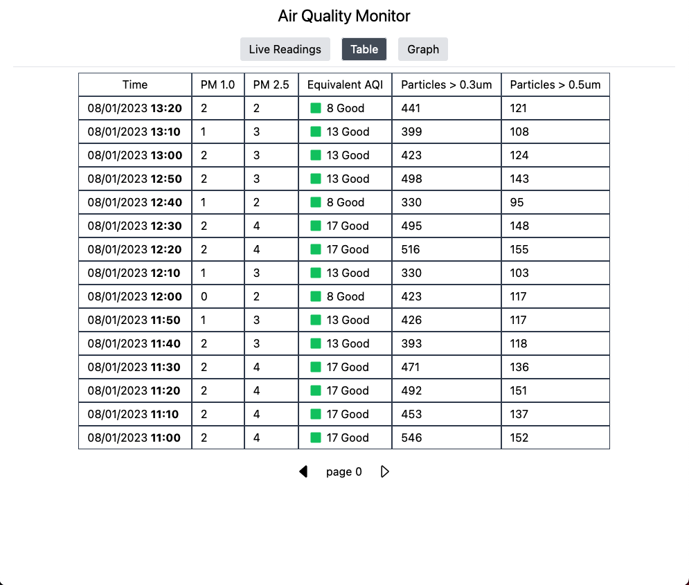

# Raspberry Pi Air Quality Monitor
### Full-stack local IOT air quality monitor that runs on a Raspberry Pi.
### Consists of 
- cron job Python script for reading data
- SQLite database for storing data
- Go chi API for retrieving stored data and creating current readings
- Preact client for displaying readings
### AQI Conversion Note
Conversion to equivalent AQI is performed using the formulas found in [this document](https://www.airnow.gov/sites/default/files/2020-05/aqi-technical-assistance-document-sept2018.pdf) from airnow.gov. \
Note that this is not _actual_ AQI, as an actual AQI calculation uses measurements over a 24-hour period and requires data about pollutants other than PM2.5 such as PM10, Ozone, CO, NO2, and SO2.
### Screenshots of Web Interface
| Live Readings (updates every 5s) |
|:--:|
|  |

| Recent Readings Table |
|:--:|
|  |

| Equivalent AQI Graph |
|:--:|
|  |

| PM 1.0 and 2.5 Graph |
|:--:|
|  |

### Required materials
- [Plantower PM2.5 Air Quality Sensor](https://learn.adafruit.com/pm25-air-quality-sensor)
- Raspberry Pi (Only tested with the Pi Zero W, but any model after the Pi 1 Model B _should_ work--no guarantees though)  
## Setup Instructions
_These instructions assume the device is running Raspberry Pi OS (previously called Raspbian). A full-featured guide to installing Raspberry Pi OS can be found [here](https://www.raspberrypi.com/software/)_
#### Set Up Hardware
Connect the detector to the Raspberry Pi using the Pi diagram [on this page](https://learn.adafruit.com/pm25-air-quality-sensor/python-and-circuitpython). \
Then enable serial output by following [these](https://learn.adafruit.com/circuitpython-on-raspberrypi-linux/uart-serial#disabling-console-and-enabling-serial-2998808) instructions on how to use `raspi-config`


#### Clone the Repository
Install Git on the Raspberry Pi. \
Then `cd /home/pi` and `git clone https://github.com/gmelsby/air-detector.git` \
_Further instructions only work if the repo is cloned into /home/pi_
#### Setup Sqlite Database
Install `sqlite3` on your device \
Then `cd /home/pi/air-detector` \
Run `cat schema.sql | sqlite3 quality.db` to create the database
#### Create Venv and Install Dependencies for Python Detector Program
Move into the `pm2_5` directory with `cd /home/pi/air-detector/pm2_5` \
Create virtual environment with `python3 -m venv .venv` \
Activate virtual environment with `source .venv/bin/activate` \
Install necessary dependencies with `pip install -r requirements.txt` \
Test that setup has been successful so far with `python3 detector.py -sv` \
If your setup has been successful, you should see output in this format: 
```
reading from sensor
writing values to database
successfully wrote to database
{"pm1": 1, "pm25": 2, "pm1env": 1, "pm25env": 2, "particles03": 504, "particles05": 126, "localTime": "2023-08-01 14:34:11"}
```
This confirms that our dependencies have installed correctly and we can read from the sensor and write to the SQLite database. \
Deactivate the virtual environment with `deactivate`
#### Create Cron Job to read and store data at a constant interval
Run `crontab -e` \
In the editor, insert the following at the bottom of the file:
```
*/10 * * * * /home/pi/air-detector/pm2_5/.venv/bin/python /home/pi/air-detector/pm2_5/detector.py -s
```
Save and exit the editor.
#### Build and Host API
Install Go by following [these instructions](https://go.dev/doc/install). The release to install will have `armv6l` in the file name--you can find a list of releases [here](https://go.dev/dl/). \
Pick the most recent release in the form `go.x.y.z.linux-armv6l.tar.gz`. \
Move to the API directory with `cd /home/pi/air-detector/webapp/api` \
Install dependencies with `go mod tidy` \
Make a directory to store built executable with `mkdir build` \
Build the executable by running `go build -o build` \
Create a systemd service to automatically run the API server by symlinking airwebappapi.service with `sudo ls -s /home/pi/air-detector/webapp/api/airwebappapi.service /etc/systemd/system/airwebappapi.service` \
Reload the systemd services with `sudo systemctl daemon-reload` \
The API should now be accessible on port 3000 of the device.
#### Build Preact App
Install the latest supported version of [node](https://nodejs.org/en) on the Pi. \
_For the Pi Zero and Pi Zero W, an unofficial build of Node from [nodejs.org](https://unofficial-builds.nodejs.org/download/release/) is the best option._ \
Navigate to the root of the client app with `cd /home/pi/air-detector/webapp/client` \
Install dependencies with `npm i`. This may take a while depending on which Raspberry Pi model you have. \
Build the client with `npm run build` \
The built static app should now be in the `dist` folder.
#### Host Client and API with Nginx
Install Nginx with apt \
Modify `/etc/nginx/nginx.conf` by inserting
```
server {
		listen 0.0.0.0:80;
		location / {
			root /home/pi/air-detector/webapp/client/dist;
			try_files $uri $uri/ /index.html;
		}
		location /api/ {
			proxy_pass http://127.0.0.1:3000/;
		}
	}
```
in the `http` block. \
Refresh Nginx with `sudo nginx -s reload` \
The client app should now be available at `[your pi's hostname].local` or `[your pi's IP address]` on your local network. \
The API should now be available at `[your pi's hostname].local/api` or `[your pi's IP address]/api`.


